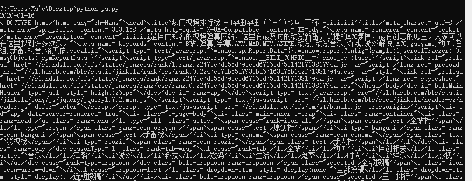
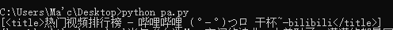

# python爬虫入门

### 爬虫实例：用python脚本爬取bilibili弹幕网上每日排行榜的榜单数据并把结果存储到postgreSQL数据库里

#### 简介：笔者新手，有一点python、postgreSQL以及html的知识，这也是本爬虫程序会涉及到的知识领域。本程序相关的大部分内容都是笔者在CSDN论坛上看教程学的，在此算是整理笔记，小结一下。

> 相关网站：
> 1. 数据来源连接 [热门视频排行榜-哔哩哔哩——干锅](https://www.bilibili.com/ranking/all/0/0/3)
> 2. python3环境搭建 [python3|菜鸟教程](https://www.runoob.com/python3/python3-install.html)
> 3. postgreSQL数据库软件下载 [pgAdmin4下载-百度](https://www.baidu.com/s?ie=utf-8&f=8&rsv_bp=1&tn=80035161_2_dg&wd=pgAdmin4%E4%B8%8B%E8%BD%BD&oq=pgAdmin4%25E4%25B8%258B%25E8%25BD%25BD&rsv_pq=92da71b200042ff5&rsv_t=f349NcA5N6jm9fsGXMH7G1qe0mtU3mWF%2F3n84sFb75RHPBtaOXr%2FR%2FzSweOsiviQqHgIGQ&rqlang=cn&rsv_enter=0&rsv_dl=tb)

***

~~以上都是废话~~

***

## **Python**

***

### python爬虫逻辑

***
目前本新手所能理解的爬虫逻辑与其说是爬取网页数据，不如说是挑选出网页源代码中含有某些关键词的区块，再进行切割  

1. 先把目标网站的html代码原样不动地请求加载到本地：  

    
    （类似这样）  

2. 之后再引用某些python库对如上代码进行关键词索引，找到含有某些关键词的相关区块：  

    
    (查询"title"相关的区块)  

3. 最后对区块进行切割  

***

### 代码

***
新建python脚本 import 相关库  

```python
#!/usr/bin/python3
# -*- coding: UTF-8 -*-

import re
from bs4 import BeautifulSoup
import requests
import json
```

re：正则表达式（虽然我没用）

BeautifulSoup：索引HTML代码并返回关键词所在区块，切割区块也是用它。没装的用户可以pip用这条 <u>pip install BeautifulSoup4</u>

requests：输入网页地址，返回网页源代码  

json：需要的朋友可以用此库把结果输出为json文件的格式

```python
def get_one_page(url):
    response = requests.get(url)
    return response.text

html_doc =get_one_page("https://www.bilibili.com/ranking/all/3/0/3")

```

这样html_doc里储存的就是网页的源代码了

```python
soup=BeautifulSoup(html_doc,'lxml')
```

以"lxml"（好像是某种格式吧）实例化html_doc，这样soup就是一个实例，soup.contents存储着网页源码  

观察网页源码发现（详情见下文的HTML部分），所有含有排名的div都属于名为"num"的class内，运用关键词索引：

```python
l1=soup.find_all('div',attrs={'class':'num'})
"""
>>>l1
[<div class="num">1</div>, <div class="num">2</div>, <div class="num">3</div>, <div class="num">4</div>, <div class="num">5</div>, <div class="num">6</div>,... <div class="num">96</div>, <div class="num">97</div>, <div class="num">98</div>, <div class="num">99</div>, <div class="num">100</div>]
"""
```

现在我们只想要div区块中间的那个数字，试着这样做:

```python
for i in l1[0]:
     print(i)
"""
1
"""
```

由此我们得到了第一个div区块中间的文本，要得到第二个的只需将l1[0]中的参数0向上加1即可，要遍及所有的div再外套一个for循环即可  

同理，观察源代码发现所有的视频信息都存储在一个名为"title"的class内

```python
l2=soup.find_all('a',attrs={'class':'title'})
for i in range(len(l2)):
    dic={}
    for k in l2[i]:
        dic["name"]=k.replace("'",'\"')
    href =l2[i]["href"]
    dic["href"]=href
    print(dic)
"""
{'name': '当年“血洗”QQ空间的神曲，太羞耻了，满满的都是回忆啊！', 'href': 'https://www.bilibili.com/video/av82724544'}
{'name': '改编版《牵丝戏》，倒放《西游记》这填词绝了！', 'href': 'https://www.bilibili.com/video/av80888974'}
{'name': '【官方】周深演唱《姜子牙》片尾曲MV发布啦', 'href': 'https://www.bilibili.com/video/av83422028'}
...
{'name': '在车站弹奏鬼灭之刃主题曲《红莲华》，围观的人会有多少？', 'href': 'https://www.bilibili.com/video/av78996367'}
{'name': '神级警告！！当指弹开唱，还有弹唱什么事？？《明日拂晓》（Pierre Bensusan《Demain Des Laube》）', 'href': 'https://www.bilibili.com/video/av82983151'}"""
```

这里的l2[i]["href"]是获取div内href的属性值，用这些的方法你可以获取到div中你想要的如何一种属性的参数值。而dic["name"]=k.replace("'",'\"')则是替代掉标题中可能会出现表示物主代词的'（单引号），确保存储数据的字典全使用单引号，原因与数据库存储有关，会在下文PostgreSQL中提到。而如需要字典输出string全用双引号包裹。。。。。。~~笔者新手忘了怎么处理~~
